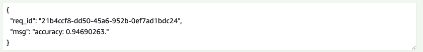
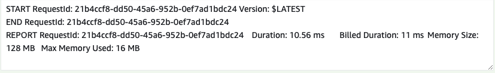

# Individual project3 from IDS721
This is a course based project from IDS721, and the main task of this project is to use AWS lambda to perform a Data Engineering related task.

## Description
This Rust project demonstrates how to use the K-nearest neighbors (KNN) algorithm for classifying the breast cancer dataset from Smartcore. The project is designed to run on AWS Lambda and respond with a message containing the accuracy of the KNN model.


## Prerequisites
To run this project, you will need the following:

1. Rust programming language (version 1.57 or newer)
2. AWS CLI (version 2.x)
3. AWS account with permissions to create and manage AWS Lambda functions
4. Git for cloning the repository
## Installation
1. Clone the repo.
```git clone https://github.com/nogibjj/IDS721_individual_proj3```
2. Build the project.
This project is writed in Arm environment. User can choose either:
```	cargo lambda build --release --arm64```
OR
```	cargo lambda build --release --x86```
3. Deploy to the AWS.
```cargo lambda deploy```

## Usage
To invoke the Lambda function and get the KNN accuracy on the breast cancer dataset, use the following command:
```cargo lambda invoke --remote --data-ascii '' --output-format json project3 [output.txt](optional)```

Check the output.txt file for the message containing the accuracy of the KNN model. Or you can just output the response to the terminal.

## Screenshots
This is the successful result from the AWS Lambda console.


This is the successful log from the AWS Lambda console.


## Weekly plan
1. Week 1: Research and Preparation
Research K-nearest neighbors (KNN) and its applications in breast cancer classification. Familiarize yourself with the breast cancer dataset from Smartcore. Set up Rust development environment and AWS CLI. Install necessary libraries and dependencies. Define project milestones. Create a GitHub repository for the project.

2. Week 2: Development
Implement the KNN algorithm using the Smartcore library. Load the breast cancer dataset and preprocess it. Train the KNN model on the dataset. Implement a Lambda function handler to wrap the KNN classifier. Package the Rust project for AWS Lambda deployment. Deploy the Lambda function to AWS and test it. Write the project's README file, including instructions for deployment and usage. Add comments and explanations to the code.

3. Week 3: Testing
Test the KNN classifier and Lambda function thoroughly. Identify and fix any bugs or performance issues. Optimize the KNN model by fine-tuning hyperparameters. Refine the Lambda function for better performance and resource usage. Review the entire project, ensuring everything is working as expected. Create a final release on GitHub. Update the README with any new information or improvements.

## Contributing
I appreciate all kinds of contributions to this project! Please feel free to open an issue to discuss your ideas or submit a pull request with your changes.
## References

* [rust-cli-template](https://github.com/kbknapp/rust-cli-template)
